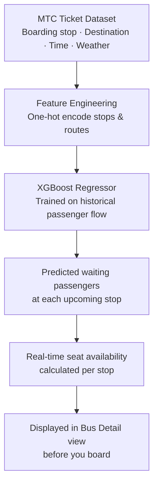
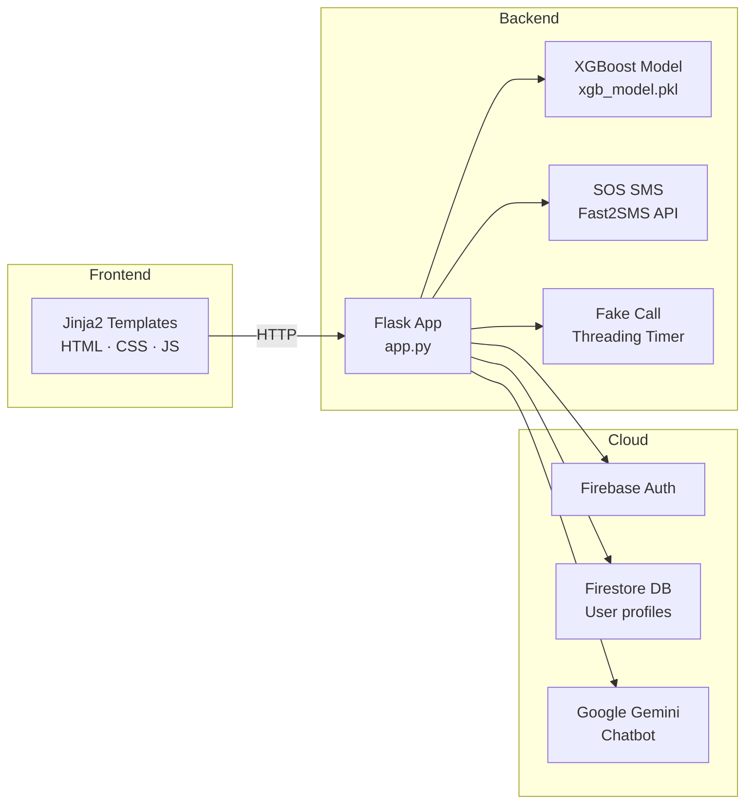

# 🚌 Buszerk

Smart Bus Management System for efficient route tracking, scheduling, and real-time passenger updates.
<!-- BADGES ROW 1 — Tech -->


<br/>

<!-- BADGES ROW 2 — Repo stats (auto-updating) -->


<br/>

> **Built for Chennai's MTC network** · Real-time crowd prediction · SOS alerts · Fake call escape · AI chatbot

</div>

---

## What is BUSZerk?

BUSZerk is a **women's safety + smart transit app** built specifically for Chennai's government bus system (MTC). It solves two problems that Chennai women face daily: not knowing if a bus is dangerously overcrowded before boarding, and having no quick safety escape when needed.

The core intelligence is an **XGBoost model trained on real MTC ticketing data** that predicts passenger load at each stop in real time. Layered on top are an SOS SMS system, a fake incoming call trigger, live bus tracking, and a Gemini-powered chatbot — all in one Flask + Firebase app, containerized with Docker.

---


## Features

| Feature | What it does |
|---|---|
| 🚌 **Smart Bus Feed** | Shows upcoming buses on your route with ETAs |
| 📊 **Crowd Prediction** | XGBoost model predicts passenger load stop-by-stop using real MTC data |
| 🆘 **SOS Alert** | One tap sends your GPS coordinates via SMS to an emergency contact (Fast2SMS API) |
| 📞 **Fake Call** | Schedules a fake incoming call in 5 seconds — instant exit from unsafe situations |
| 🗺️ **Bus Tracking** | Live tracking view tied to your Firebase profile |
| 🤖 **AI Chatbot** | Gemini-powered assistant for route queries and safety guidance |
| 🔐 **Auth** | Firebase Authentication + Firestore user profiles |

---

## How the ML model works



The model is loaded from `xgb_model.pkl` at startup and runs inference on each stop when a user views bus details. Random simulation for boarding/alighting is layered on top to reflect real bus dynamics.

---

## Architecture



---

## Project structure

```
BUSZerk/
├── app.py                  # Flask routes + ML inference + SOS logic
├── BUSZERK1_.ipynb         # Model training notebook (XGBoost on MTC data)
├── MTC_TICKET_MON1.csv     # Real MTC ticketing dataset
├── xgb_model.pkl           # Trained XGBoost model
├── feature_columns.pkl     # Saved feature schema for inference
├── Dockerfile              # Multi-stage Docker build
├── templates/
│   ├── home.html           # Bus feed + route search
│   ├── bus_details.html    # Stop-by-stop crowd prediction
│   ├── sos.html            # SOS trigger page
│   ├── fake_call.html      # Fake call interface
│   ├── bus_tracking.html   # Live tracking
│   ├── chatbot.html        # Gemini chatbot
│   ├── login.html
│   └── signup.html
└── node_modules/
    └── @google/generative-ai   # Gemini SDK
```

---

## Getting started

### Prerequisites
- Python 3.9+
- Docker (optional but recommended)
- Firebase project with Authentication + Firestore enabled
- Fast2SMS API key
- Google Gemini API key

### Run locally

```bash
# Clone the repo
git clone https://github.com/Kumar070204/BUSZerk.git
cd BUSZerk/Buszerk-main

# Install dependencies
pip install -r requirements.txt

# Add your Firebase service account key
# → Drop buszerk-a24ab-firebase-adminsdk-*.json into the project root

# Run
python app.py
```

App runs at `http://localhost:5000`

### Run with Docker

```bash
docker build -t buszerk .
docker run -p 5000:5000 buszerk
```

---

## Dataset

Training data is sourced from **MTC (Metropolitan Transport Corporation) Chennai** ticket logs — `MTC_TICKET_MON1.csv`. Fields include:

| Column | Description |
|---|---|
| `Bus_ID` | MTC bus identifier |
| `Route_ID` | Route number |
| `Boarding_Stop` | Passenger origin stop |
| `Destination_Stop` | Passenger destination |
| `Day_of_Week` | Monday–Sunday |
| `Time` | Departure time slot |
| `Weather` | Weather condition at time of journey |

The XGBoost model is trained in `BUSZERK1_.ipynb` — see the notebook for preprocessing steps, feature engineering, and evaluation metrics.

---

## API reference

| Endpoint | Method | Description |
|---|---|---|
| `/` | GET/POST | Home — bus feed, route search |
| `/bus/<id>` | GET | Stop-by-stop crowd prediction for a bus |
| `/send_sos` | POST | Trigger SOS SMS with lat/lng |
| `/trigger_call` | POST | Schedule fake incoming call |
| `/check_call` | GET | Poll call status |
| `/chatbot` | GET | Gemini AI chatbot interface |
| `/bus_tracking` | GET | Live bus tracking view |
| `/login` `/signup` `/logout` | GET/POST | Auth flows |

---

## Built by

**Kumaraswamy G** — ML & GenAI Developer, VIT Chennai

[](https://linkedin.com/in/kumaraswamy-g-872b81277/)
[](mailto:kumaraswamy2004@gmail.com)

---

